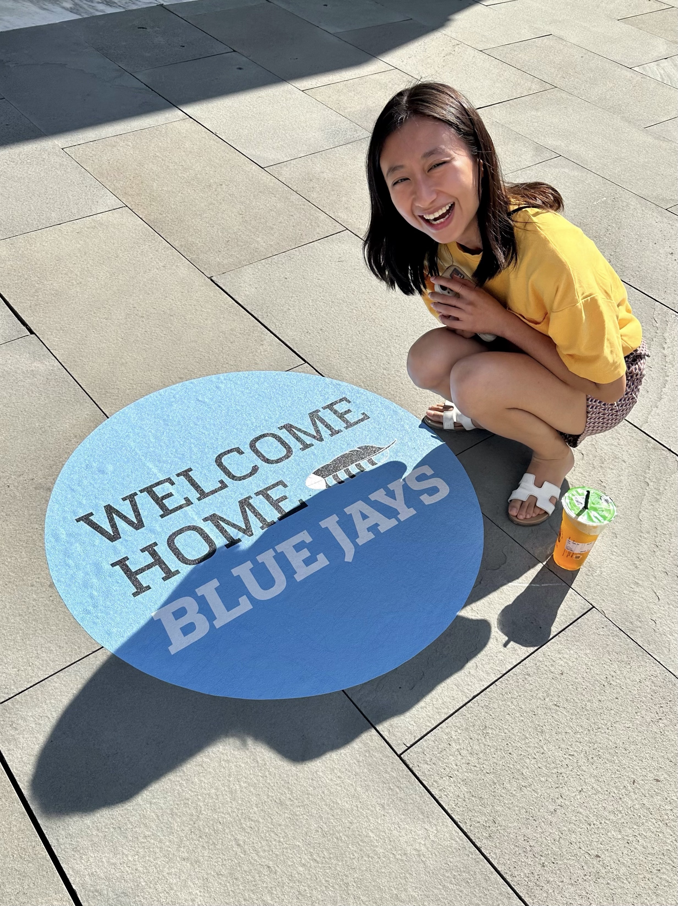

## Bio

I am a medical student at Vanderbilt University School of Medicine and currently pursuing my masters in Health Science Informatics. I am interested in the field of ophthalmology and utilization of bioinformatic tools to solve problems in healthcare.

## Education

**B.S. 2019** \| Neuroscience; Molecular and Cellular Biology \| Johns Hopkins University

**M.D.** in progress \| Vanderbilt University School of Medicine (currently on leave)

**M.S.** in progress \| Health Sciences Informatics \| Johns Hopkins University

Happy to be back to Hopkins again. Forever a blue jay!!

{width="258"}
